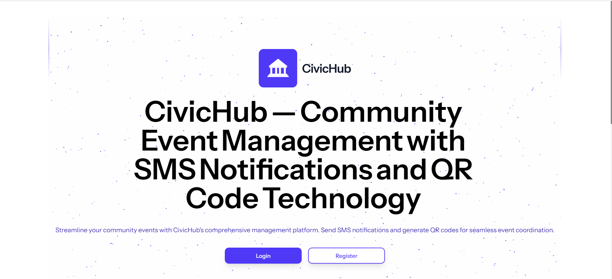
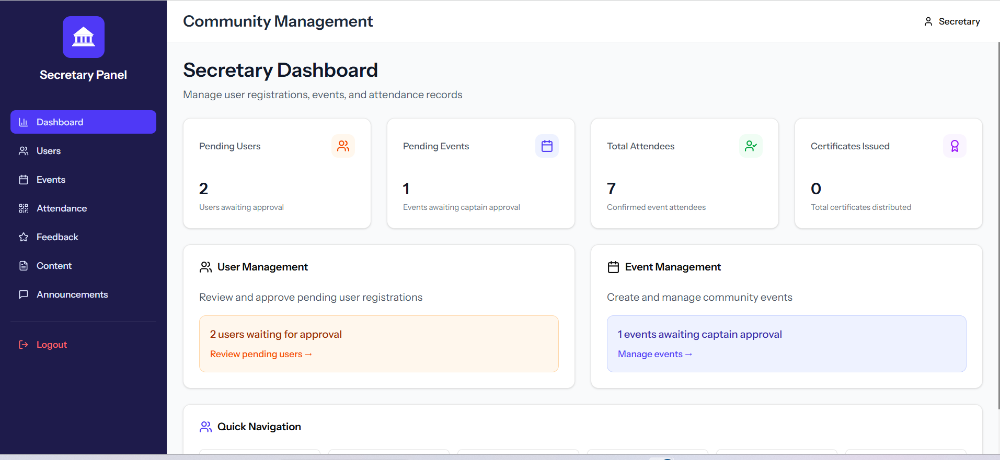
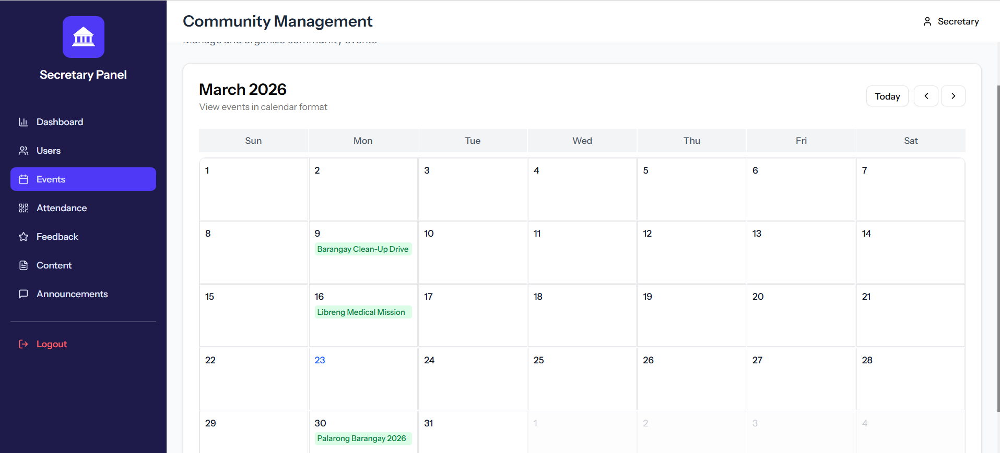
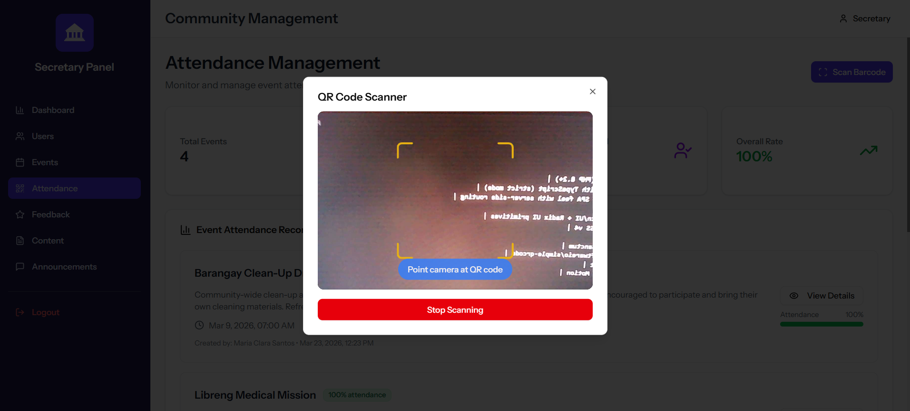
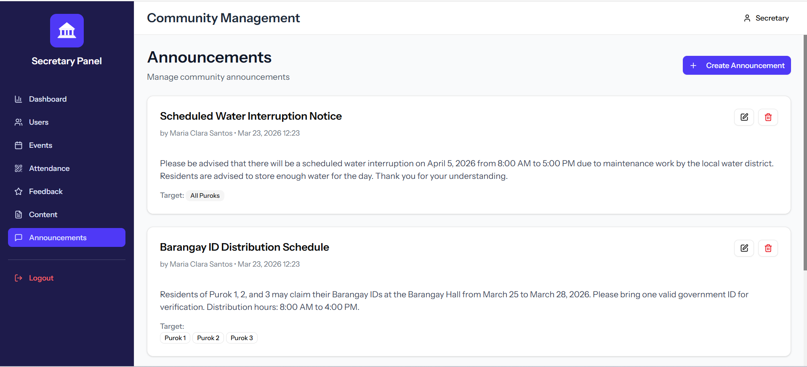

<div align="center">

# CivicHub

### Barangay Event Management System & Information System (BEMSIS)

A modern, full-stack web application for managing barangay events, tracking attendance via QR codes, generating certificates, and organizing resident information — built with Laravel 12, React 19, and TypeScript.

[](https://laravel.com)
[](https://react.dev)
[](https://www.typescriptlang.org)
[](https://www.mysql.com)
[](https://tailwindcss.com)
[](LICENSE)

</div>

---

## About

**CivicHub** is a comprehensive barangay management system designed for Philippine local government units (LGUs). It streamlines event coordination, automates attendance tracking through QR codes, generates certificates for participants, and provides role-based dashboards for different stakeholders — from the Barangay Captain to individual residents.

Built as a modern single-page application using **Inertia.js** to bridge Laravel and React, CivicHub delivers a seamless, app-like experience with server-side security and type-safe frontend components.

Whether you're a barangay looking to digitize operations or a developer studying full-stack architecture, CivicHub provides a production-ready reference implementation.

---

## Key Features

**Event Management & Approval Workflow**
- Create, edit, and manage barangay events with rich details (venue, date, description, poster image)
- Multi-purok targeting — scope events to specific puroks or broadcast to all residents
- Captain approval workflow — events require approval before going live
- Partner agency event requests with endorsement support

**QR Code Attendance Tracking**
- Automatic QR code generation per registered attendee
- Real-time QR scanning interface for secretaries
- Time-in / time-out logging with on-time and late tracking
- Attendance status management (confirmed, declined)

**Certificate Generation**
- Automatic certificate creation for event attendees
- Unique certificate codes for verification
- Public certificate verification via shareable links

**SMS Notifications & Reminders** *(Optional)*
- Automated event reminders sent the day before an event
- Configurable SMS integration via sms.iprogtech.com
- SMS logging for audit trails

**Role-Based Access Control**
- **Captain** — System administrator: approve/decline events, activate/deactivate users
- **Secretary** — Event coordinator: full event CRUD, QR attendance scanning, certificate assignment, announcements
- **Partner Agency** — External organizations: submit event requests, upload feedback and certificates
- **Resident** — Community members: browse events, register, view attendance history, download certificates, submit feedback

**Security & Authentication**
- Account lockout after 5 failed login attempts (15-minute cooldown)
- Device verification with trusted device management
- OTP-based password reset via email
- Session timeout after 15 minutes of inactivity
- Real-time online/offline status tracking

**Announcements System**
- Create purok-targeted or barangay-wide announcements
- Secretary-managed content distribution

---

## Tech Stack

| Layer | Technology |
|-------|-----------|
| **Backend** | Laravel 12 (PHP 8.2+) |
| **Frontend** | React 19 with TypeScript (strict mode) |
| **Bridge** | Inertia.js — SPA feel with server-side routing |
| **Database** | MySQL 8+ |
| **UI Components** | Shadcn/UI + Radix UI primitives |
| **Styling** | Tailwind CSS v4 |
| **Build Tool** | Vite |
| **API Auth** | Laravel Sanctum |
| **QR Codes** | simplesoftwareio/simple-qrcode |
| **Icons** | Lucide React |
| **Animations** | Framer Motion |

---

## Screenshots

> Add your screenshots to a `docs/screenshots/` directory and update the paths below.

| Landing Page | Dashboard |
|:---:|:---:|
|  |  |

| Event Management | QR Attendance |
|:---:|:---:|
|  |  |

| Certificates | Announcements |
|:---:|:---:|
|  |  |

---

## Quick Start

### Prerequisites

- **PHP** >= 8.2
- **Composer** >= 2.0
- **Node.js** >= 18
- **MySQL** >= 8.0

### Installation

```bash
# Clone the repository
git clone https://github.com/your-username/civichub.git
cd civichub

# Install PHP dependencies
composer install

# Install Node.js dependencies
npm install

# Copy environment configuration
cp .env.example .env

# Generate application key
php artisan key:generate
```

### Database Setup

1. Create a MySQL database:

```sql
CREATE DATABASE civichub;
```

2. Update your `.env` file with your database credentials:

```env
DB_CONNECTION=mysql
DB_HOST=127.0.0.1
DB_PORT=3306
DB_DATABASE=civichub
DB_USERNAME=root
DB_PASSWORD=your_password
```

3. Run migrations and seed demo data:

```bash
php artisan migrate:fresh --seed
```

### Start Development Server

```bash
# Start all services (Laravel + Vite + Queue Worker) concurrently
composer run dev
```

Visit **http://localhost:8000** in your browser.

---

## Demo Credentials

After running the seeders, you can log in with these accounts:

| Role | Email | Password |
|------|-------|----------|
| **Captain** (Admin) | `captain@gmail.com` | `password123` |
| **Secretary** (Coordinator) | `secretary@gmail.com` | `password123` |
| **Resident** | `resident@gmail.com` | `password123` |
| **Partner Agency** | `partner@gmail.com` | `password123` |

> The login page also has a **Demo Accounts** section — click any role to auto-fill credentials.

Additional seeded accounts: `resident2@gmail.com`, `resident3@gmail.com` (pending), `resident4@gmail.com`, `resident5@gmail.com`, `partner2@gmail.com` (pending).

---

## Project Structure

```
app/
├── Console/Commands/        # Artisan commands (SMS reminders, offline marking)
├── Http/
│   ├── Controllers/
│   │   ├── Auth/            # Login, Register, Password Reset, Device Verification
│   │   ├── Captain/         # Event approval, user activation
│   │   ├── Secretary/       # Event CRUD, attendance, certificates, announcements
│   │   ├── Partner/         # Partner event requests, profile management
│   │   └── Resident/        # Event registration, feedback, certificates
│   └── Middleware/           # Role guards, session tracking, activity tracking
├── Models/                   # Eloquent models with relationships
└── Mail/                     # Email templates (OTP, device verification)

resources/js/
├── components/
│   ├── ui/                   # Shadcn/UI primitives
│   ├── admin/                # Admin-specific components
│   ├── landing/              # Landing page components
│   └── user/                 # User-facing components
├── layouts/                  # App and auth layout wrappers
└── pages/
    ├── Auth/                 # Login, Register, Password Reset pages
    ├── Captain/              # Captain dashboard and management pages
    ├── Secretary/            # Secretary dashboard and management pages
    ├── Partner/              # Partner dashboard and management pages
    └── Resident/             # Resident dashboard and management pages

database/
├── migrations/               # Database schema (PostgreSQL)
└── seeders/                  # Demo data seeders
```

---

## SMS Configuration (Optional)

CivicHub can send SMS notifications for event reminders. This feature is **optional** — the system works fully without it.

To enable SMS:

1. Sign up at [sms.iprogtech.com](https://sms.iprogtech.com) and get your API key
2. Add your API key to `.env`:

```env
SMS_API_KEY=your_api_key_here
```

3. Schedule the reminder command (add to your server's cron):

```bash
* * * * * cd /path-to-project && php artisan schedule:run >> /dev/null 2>&1
```

---

## Available Commands

### Development

```bash
composer run dev          # Start all services concurrently (recommended)
npm run dev               # Vite dev server only
php artisan serve         # Laravel server only
```

### Build

```bash
npm run build             # Production frontend build
npm run build:ssr         # SSR build
```

### Code Quality

```bash
npm run lint              # ESLint with auto-fix
npm run format            # Prettier formatting
npm run format:check      # Check formatting
npm run types             # TypeScript type checking
```

### Database

```bash
php artisan migrate                # Run pending migrations
php artisan migrate:fresh --seed   # Reset database with demo data
```

### Testing

```bash
php artisan test                            # Run all tests
php artisan test --filter=TestClassName     # Run specific test class
```

---

## Contributing

Contributions are welcome! Here's how to get started:

1. **Fork** the repository
2. **Create** a feature branch: `git checkout -b feature/amazing-feature`
3. **Commit** your changes: `git commit -m 'Add amazing feature'`
4. **Push** to the branch: `git push origin feature/amazing-feature`
5. **Open** a Pull Request

### Code Style

- **PHP**: Follow Laravel conventions
- **TypeScript**: Strict mode enabled — run `npm run types` before committing
- **Formatting**: Prettier with single quotes, semicolons, 150 char width
- **CSS**: Tailwind utility classes with the class sorting plugin

---

## License

This project is licensed under the MIT License — see the [LICENSE](LICENSE) file for details.

---

<div align="center">

**Built with passion by [Prince Sanguan](https://github.com/PrinceSangworkeduan)**

If you find this project useful, consider giving it a star!

</div>
